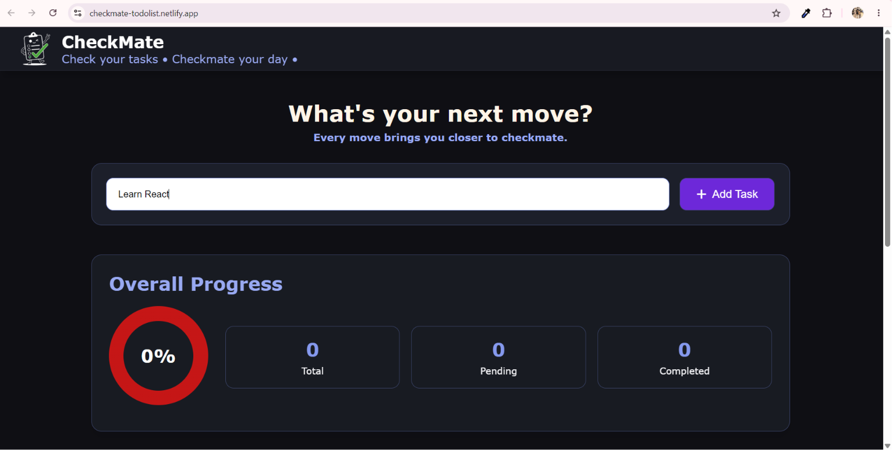
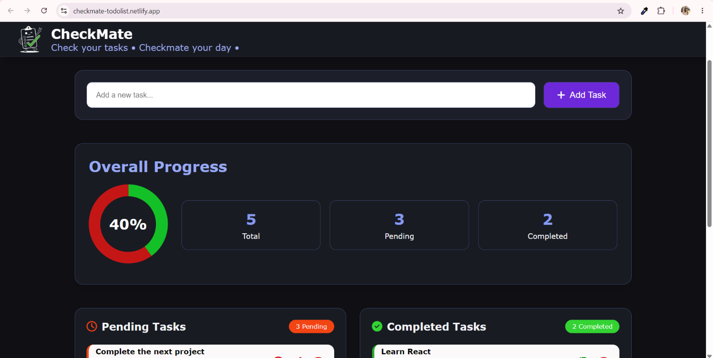
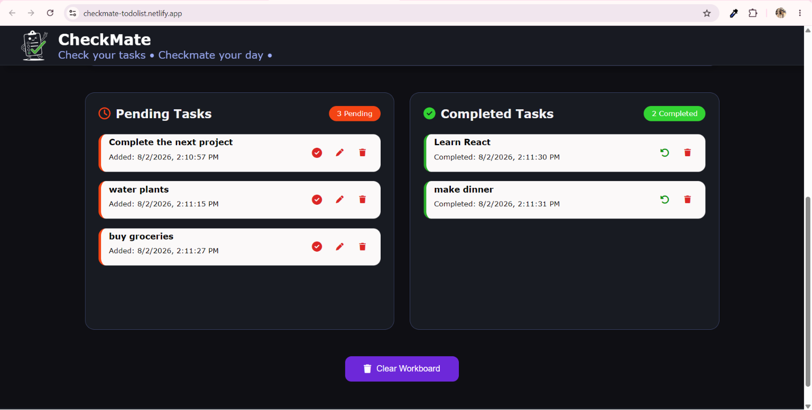
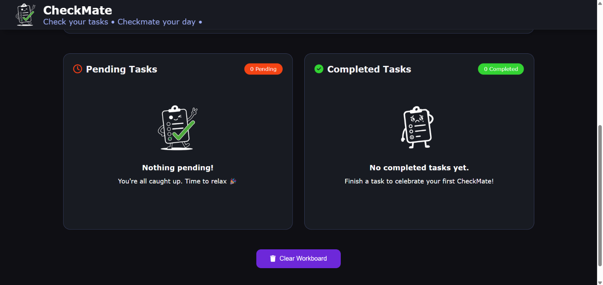

# CheckMate – To-Do List Web App

A modern and responsive To-Do List web application built using HTML, CSS, and Vanilla JavaScript. It helps users organize tasks efficiently with features like task management, progress tracking, local storage, and a clean user interface.

This project was created as part of **Level 2 – Task 2** of the Oasis Infobyte Web Development Internship.

## 🔗 Project Links

**Live Demo:** [https://checkmate-todo-app-link.netlify.app](https://checkmate-todolist.netlify.app/)

**GitHub Repository:** [https://github.com/Jhanvi-code23/OIBSIP/tree/main/WebDev-L2-ToDoList](https://github.com/Jhanvi-code23/OIBSIP/new/main/WebDev-L2-ToDoList)

---

## 🚀 Features

- Responsive and modern UI
- Add new tasks
- Edit existing tasks
- Delete individual tasks
- Mark tasks as completed
- Undo completed tasks
- Separate Pending & Completed task sections
- Task timestamps (Added & Completed)
- Progress donut chart
- Task statistics dashboard
- Pending & Completed task counters
- Clear All tasks
- Local Storage support (tasks persist after refresh)
- Empty state illustrations

---

## 🛠️ Technologies Used

- HTML5
- CSS3
- JavaScript (Vanilla)

---

## 📂 Project Structure

```
WebDev-L2-ToDoList
│
├── assets/
├── index.html
├── style.css
├── script.js
├── README.md
└── Screenshots/
```

---

## 📸 Screenshots

### Input Page

  

### Progress Dashboard

  

### Task Lists

  

### Empty State Lists

  

---

## 📚 What I Learned

Working on this project helped me improve my understanding of:

- DOM manipulation
- Creating dynamic UI using JavaScript
- Event handling
- Working with arrays and objects
- Using Local Storage to persist data
- Updating UI based on application state
- Responsive web design
- Managing application logic efficiently

---

## ▶️ How to Run

Clone the repository.

```bash
git clone https://github.com/Jhanvi-code23/OIBSIP.git
```

Open the To-Do List project folder.

```bash
cd OIBSIP/WebDev-L2-ToDoList
```

Open `index.html` in your preferred web browser.

---

## 👩‍💻 Author

**Jhanvi Gupta**

**GitHub:** https://github.com/Jhanvi-code23

**LinkedIn:** https://www.linkedin.com/in/jhanvi-gupta-975514320/
